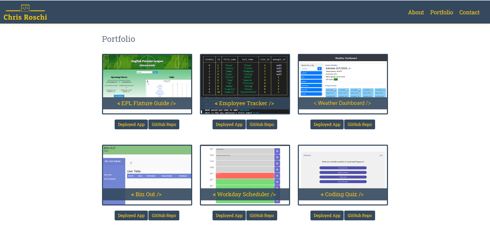

# React Portfolio

## Description
A portfolio showcasing some of my projects and applications from the Adelaide University Coding Bootcamp. Portfolio created using React.  

## Table of Contents
1. [Installation](#Installation)
2. [Usage](#Usage)
3. [License](#License)
4. [Contribution](#Contribution)
5. [Questions](#Questions)

## Installation
None.

## Usage
You can view my porfolio here: https://cr-53.github.io/React-Portfolio/

## License
MIT  
 

## Contribution
Not open for contributions.

## Tests
None.

## Questions
You can view my GitHub profile here: https://github.com/CR-53 
If you have any questions, feel free to send me an email: chrisroschi53@gmail.com
